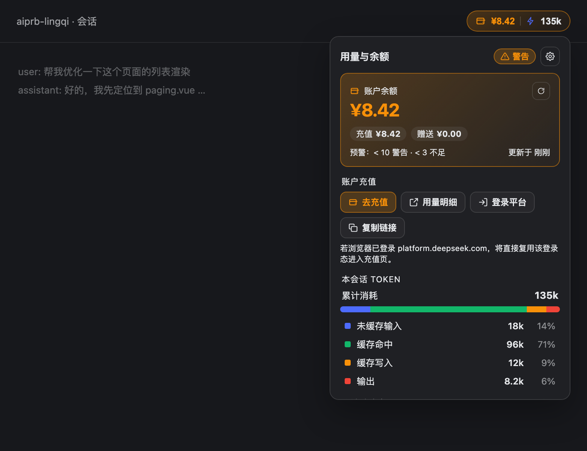

# dsh-usage-panel

[English](README.en.md) | **简体中文**

为 [DSH（DeepSeek Harness）](https://github.com/deepseek-ai/deepseek-harness) Web 界面提供 **DeepSeek 账户余额**与**本会话 Token 用量**，以彩色胶囊显示在会话头部右侧。



## 功能

- **余额**：官方 `GET /user/balance`，显示总额 / 充值 / 赠送。
- **Token 用量**：读取宿主 `tokenUsage` 投影，显示未缓存输入 / 缓存命中 / 缓存写入 / 输出 / 合计 / 缓存命中率。
- **三级余额预警**（阈值可自定义）：充足 / 警告 / 不足，胶囊与卡片颜色随之变化。
- **充值入口**：去充值 / 用量明细 / 登录平台 / 复制链接；支持新标签、当前标签、复制链接三种打开方式。
- **查询效率**：仅在页面可见时轮询（隐藏暂停）、失败指数退避、宿主 30s 缓存 + 单飞、手动刷新。
- **跨版本兼容**：宿主端优先 `ctx.connection.fetch` 并回退 `ctx.webServer`；浏览器端依次尝试会话头部插槽。

## 安装

方式一：作为插件包安装（推荐）

```sh
dsh plugin --profile web add dsh-usage-panel
```

方式二：本地安装脚本

```sh
node install.mjs --home ~/.dsh --profile web
```

重启 `dsh web`（或等待热重载）后刷新页面。

## 配置（宿主端）

`apply(ctx, config)` 可读取 patch 行中的可选配置：

| 字段 | 默认值 | 说明 |
| --- | --- | --- |
| `routePath` | `/api/usage-panel/balance` | 宿主端路由 |
| `cacheMs` | `30000` | 上游缓存与单飞窗口 |
| `apiKeyEnv` | `DEEPSEEK_API_KEY` | 经 `ctx.credentials` 解析，再回退环境变量 |
| `baseUrl` | `https://api.deepseek.com` | 服务商地址 |
| `baseUrlEnv` | `DEEPSEEK_BASE_URL` | 覆盖 `baseUrl` 的环境变量 |

## 兼容性

- **宿主端**：Node >= 18，零 `import`，可从任意路径加载；优先 `ctx.connection.fetch.register`，回退 `ctx.webServer.register`；密钥优先走 `ctx.credentials`。
- **浏览器端**：仅依赖内置 React 与 `slots` 服务；优先 `conversation.session.header.utilities`，其次 `conversation.session.header.corner`，`sidebar.footer.action` 为延迟 4 秒的兜底，因此正常启动不会跑到左下角；缺少 `useProjection` 时仍显示余额。
- 纯 JS、无平台相关代码，跨机型通用。

## 自检

```sh
node tools/verify.mjs --port 3080 --home ~/.dsh
```

输出启动图、HMR 通道与服务包特性。

## 卸载

删除 profile patch 中的 `usage-panel` 行，并删除 `<home>/plugins/dsh-usage-panel`。

## 作者

Mysterious Mark

## 许可

[MIT](LICENSE)
